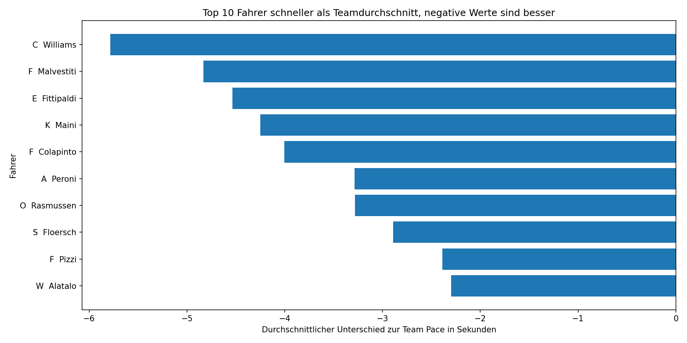

# 🏎️ Formula 3 Machine Learning Pipeline  
## Multi-Season Data Analysis (2019–2025)

This project automates the collection, cleaning and analysis of FIA Formula 3 race data.  
The pipeline downloads race results across multiple seasons, standardizes them and produces an ML-ready dataset.  
All analyses, visualizations and transformations were carried out entirely in Python.

[🇩🇪 Zur deutschen Version](README.md)

---

# 📂 Project Overview

- Data scraping  
- Data cleaning  
- Feature engineering  
- Exploratory analysis  
- Machine learning (in preparation)  

---

# 📥 Data Sources

All data is collected from the official FIA Formula 3 website.  
Each race is accessible via a `race_id`, for example:

https://www.fiaformula3.com/Results?raceid=1002

We collected all race IDs for the seasons 2019 to 2025 and processed them automatically.

---

# 🧹 Data Cleaning

### Steps:

- Extraction of all HTML tables via pandas  
- Parsing of the driver information into: name, car number, team, status  
- Removal of irrelevant sessions (practice, standings, info tables)  
- Keeping only true race sessions:  
  **ROUND1Summary, ROUND2Summary, ROUND3Summary**  
- Conversion of all time fields into seconds  
- Cleaning of DNF, DNS and DSQ statuses  
- Creation of a clean race-only dataset  

Resulting files:

- `f3_2019_2025_raw_results.csv`  
- `f3_2019_2025_races_only_final.csv`

---

# 🧠 Feature Engineering

We generated a broad set of features for later machine learning tasks.

### Time & Performance Features
- `time_s` (total race time in seconds)  
- `best_lap_s` (best lap of the driver)  
- `avg_lap_time_s` (average lap time)  
- `winner_time_s` (fastest race time)  
- `time_from_winner_s`  

### Lap-Based Features
- `laps_clean` (numeric lap count)  
- `race_max_laps`  
- `rel_laps` (relative number of laps completed)

### Team & Driver Features
- `team_speed` (average pace per team — derived for ML prep)  
- `driver_speed`  
- `driver_top10_rate`  
- `driver_vs_team` (driver pace relative to team average)  
- `lap_vs_race_avg` (lap time vs. race average)

### Status Flags
- `finished`  
- `is_dnf`  
- `is_dns`  
- `is_dsq`  

### Session Encoding
- `ROUND1Summary` → 1  
- `ROUND2Summary` → 2  
- `ROUND3Summary` → 3  

Final file:

`f3_2019_2025_races_features.csv`

---

# 📊 Exploratory Data Analysis (EDA)

After building the ML-ready dataset, the first visualizations were created.

---

## 1. Distribution of Race Positions

**Interpretation:**  
Race positions are evenly distributed across the field.  
There is no structural bias and all positions from 1 to 30 occur frequently, which is ideal for modeling.

---

## 2. Team Performance – Average Finishing Position

**Interpretation:**  
Teams like TRIDENT, PREMA and ART Grand Prix consistently perform at the top.  
Teams such as PHM Racing or Charouz tend to finish near the back of the field.

---

## 3. Fastest Drivers – Average Lap Time

**Interpretation:**  
The top 20 drivers have extremely similar average lap times.  
Several drivers from smaller teams appear surprisingly high, showing that raw pace is not always tied to team strength.

---

## 4. Top Drivers by Average Race Position

**Interpretation:**  
This plot highlights the most consistent top performers in race results.  
Only drivers with at least 5 starts are included to avoid statistical noise.

---

## 5. Team DNF Rate

**Interpretation:**  
Some teams (e.g., Charouz, PHM) show significantly higher DNF rates.  
Low-DNF teams gain a huge strategic advantage across a season.

---

## 6. Driver Consistency (Variance of Race Positions)

**Interpretation:**  
Drivers with low variance are the most consistent.  
A low variance means the driver delivers stable performance independent of track or conditions.

---

## 7. Driver Development Over Time

**Interpretation:**  
Shows how a selected driver performs over multiple seasons.  
Trends such as steady improvement, decline or stagnation become visible.

---

## 8. Team Performance Over Time

**Interpretation:**  
This plot visualizes long-term trends of each team.  
You can clearly see dominant eras, rising teams or long-term decline.

---

## 9. Team Position Boxplot

**Interpretation:**  
The boxplot displays the distribution of finishing positions per team.  
It highlights which teams are both strong *and consistent* versus those with highly variable results.

---

## 10. Driver vs Team – Best Performers

**Interpretation:**  
Shows drivers who regularly outperform their team’s average pace.  
These drivers are often indicators of future F2 or F1 potential.

---

## 11. Driver vs Team – Underperformers

**Interpretation:**  
Displays drivers who perform significantly below the pace of their teammates.  
This may point to inexperience, setup struggles or inconsistency.

---

## 12. Heatmap – Latest Season (Start Position vs Finish Position)

**Interpretation:**  
Visualizes the correlation between starting and finishing positions.  
Expected pattern: starting further ahead usually leads to better results, with room for surprises and strong recovery drives.

---

# 🧠 Machine Learning (Next Step)

Planned models:

- Classification: Top-10 prediction  
- Regression: race position prediction  
- Survival / hazard models: probability of DNF  
- Team ranking models  
- Feature importance (XGBoost, Random Forest, SHAP)  

---

# 📎 Reproducibility

All steps were performed entirely in Python using:

- pandas  
- numpy  
- requests  
- BeautifulSoup (optional)  
- matplotlib / seaborn  
- scikit-learn (planned)  

Python scripts in this project:

- `Daten_hinzufügen.py`  
- `driver_cleaning.py`  
- `times_cleaning.py`  
- `race_only_bereinigung.py`  
- `feature_engineering.py`  
- `explorative_analyse.py`

---

# 👤 Project Team

This project is part of our Formula Data Analysis (F1/F2/F3/F4).  
Formula 3 serves as the first fully completed example used to build and validate the entire pipeline.

---

# ✔️ Status

- Data collection: completed  
- Data cleaning: completed  
- Feature engineering: completed  
- Exploratory analysis: completed  
- ML models: in planning  

---

# 📌 License

For study and analysis purposes only.  
No commercial use of the original data is permitted.
